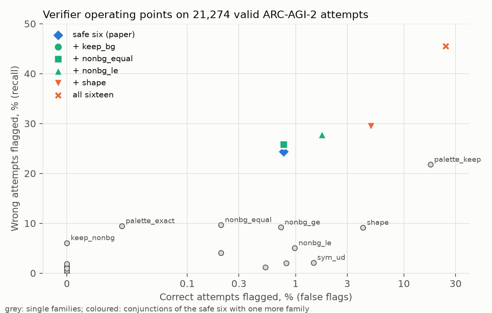

# The Demonstrations Are a Verifier: Train-Pair Invariants for ARC-AGI-2 Answer Selection

*A zero-parameter CPU check, measured on 80,000 attempts from 68 to 73 AI systems, ablated family by family, and added to the NVARC Kaggle pipeline*

## Abstract

Every ARC task states its rule through a few demonstration pairs. We turn properties that hold on all demonstrations into a verifier: no model, no training. Six families selected on the ARC-AGI-2 training set hold for 98.2% of ARC-AGI-2 evaluation outputs (99.8% on ARC-AGI-1, 95.0% on ConceptARC), flag 24% of wrong attempts from 68 frontier systems and 0.8% of correct ones. As a one-vote penalty it never lowered average pass@2 in pooled selection, even with unsafe families, and raised pass@1 for 24 of 68 systems; ablations show that safety comes from the penalty, not the family list, and that hand-designed invariants see few near misses. Our NVARC-based submission ships it (public score 29.72); there its measured effect is zero.

## 1. Introduction

Strong ARC-AGI-2 systems produce many candidates but may submit two. Pooling eight random frontier systems puts a correct answer in the pool for 77% of public evaluation tasks, yet majority vote picks it for only 56%. How much of that gap can the demonstrations close, how reliable are such checks on a benchmark built to defeat shortcuts, and when do they hurt?

## 2. Prior work

Winning Kaggle systems score candidates with the generator: augmented likelihood (ARChitects 2024, Franzen et al. 2025) or NVARC's kgmon (2025 winner): augmented-decode hits minus augmented NLL. Program synthesis keeps programs that reproduce every train pair (icecuber 2020, Greenblatt 2024, SOAR 2025) but cannot check transductive outputs. The ARC-AGI-2 technical report's pipeline (27%; Lemes de Oliveira et al., arXiv:2603.06590) prunes decoded candidates with colour, size and inclusion filters (about 1% degradation on internal tests). No public work measures how often such invariants transfer to ARC-AGI-2 test outputs, family by family, or their effect on selection.

## 3. Approach

**Invariant families.** A family is *inferred* when it holds on every train pair; a candidate is *flagged* when it violates an inferred family. Sixteen families: **shape** (train-consistent size rules over input features), **palette** (exact colour delta or constant palette; subset; keep), **counts** (histogram equal; non-background count equal, non-decreasing, non-increasing), **content** (non-background kept; background kept; crop of input; input embedded in output) and four output **symmetries**.

**Safe families.** On the ARC-AGI-2 *training* set (1,076 test outputs) we keep families inferred at least 30 times that hold at least 99% of the time: palette_exact, palette_subset, hist_equal, nonbg_ge, keep_nonbg, input_in_output. Shape (98.6%), keep_bg (95.1%) and nonbg_equal (96.9%) miss the bar; the set was fixed before any evaluation-set measurement.

**Using flags.** (a) *Attempt order:* swap the two attempts when only attempt 1 is flagged. (b) *Pool selection:* rank candidates by support (votes, or NVARC hits) minus λ·flag; λ=∞ is a hard veto; we use λ=1, one vote per violated invariant.

**Kaggle submission.** We fork the NVARC 2025 notebook (Qwen3-4B, per-task test-time training, augmented decoding, kgmon; configuration in the appendix) and change only the final ranking, to kgmon − 1·flag; with no flags the output is identical.

## 4. Why it works, and when it hurts

**Soundness.** A task applies one rule to every pair, so a property implied by the rule also holds on the test. A property holding on k demonstrations *by coincidence* must get lucky k times; per-pair coincidence rates (pass rates on unrelated outputs) are 0.4% for palette_exact and 0% for keep_nonbg and hist_equal. The remaining failures are **coverage gaps**: the demonstrations never show the part of the rule the test needs, as in all three ARC-AGI-2 evaluation failures (446ef5d2: the test removes a colour no demonstration removed). Gaps shrink with more demonstrations (failures 1.2% at k=2, 0% at k≥5 on ARC-AGI-2 training; 7.6% to 3% on ConceptARC), and so does recall, since each pair can only remove families (31% at k=2, 13% at k=4).

**Selection risk.** Let ε = P(flag | correct). Raising λ changes a task only when the correct answer c* crosses the top-2 boundary: a **gain** needs a flagged wrong candidate less than λ above an unflagged c*; a **loss** needs a flagged c* with two unflagged candidates less than λ below it. A hard veto's loss is about ε·P(c* already in top-2), growing as the base selector improves while the gain shrinks: vetoes help weak pools and hurt saturated ones. With λ=1 a loss also needs a tie on support, making it second-order.

## 5. Results

Intervals: 95% task bootstraps; tables in the appendix.

**Soundness (Fig. 1).** The six safe families jointly hold for 99.2% of ARC-AGI-2 training, 98.2% of ARC-AGI-2 evaluation, 99.8% of ARC-AGI-1 evaluation and 95.0% of ConceptARC outputs (160 tasks by other authors), and reject 91% of unrelated tasks' outputs.

**Error taxonomy (Fig. 2).** Of 22,320 ARC-AGI-2 attempt slots from 68 systems (classes in Fig. 2; near miss: ≥95% of cells right), the verifier flags 24.4% of valid wrong attempts (44% of wrong-palette, 14% of near misses) and 0.8% of correct ones, all on the three coverage-gap outputs; on ARC-AGI-1 (57,854 slots, 73 systems) 23.9% and 0.4%.

**Which families matter (Fig. 4).** Removing palette_exact costs the most recall (24.4% to 17.6%), then keep_nonbg (19.1%) and nonbg_ge (19.5%). All sixteen families reach 45.5% recall but flag 24.3% of correct answers and see only 27% of near misses. keep_bg and nonbg_equal, excluded by the training bar, would have added recall for free (25.7%, 25.8%).

**Attempt order.** Swapping flagged first attempts: ARC-AGI-2, 24 of 68 systems improved, none got worse, +0.51 pass@1 points [0.36, 0.65]; ARC-AGI-1, 61 of 73 improved, +1.12 [0.98, 1.28].

**Pooled selection (Fig. 3).** Pass@2 (%) on ARC-AGI-2 for random pools, 200 draws per size:

| Systems | Vote | One-vote penalty | Hard veto |
|---|---|---|---|
| 2 | 36.4 | +1.1 [0.7, 1.4] | +1.1 |
| 4 | 42.9 | +3.1 [2.4, 3.9] | +3.0 |
| 8 | 56.3 | +2.0 [1.5, 2.6] | +2.1 |
| 16 | 72.5 | +0.8 [0.4, 1.1] | +1.0 |
| 32 | 80.7 | +0.4 [0.1, 0.7] | +0.8 |
| all 68 | 84.9 | 0.0 | −0.8 [−2.5, 0.0] |

The one-vote penalty is never negative on average, losing to plain voting in 14 of 1,000 random pools; the hard veto turns negative on the full pool, on the coverage-gap tasks. On ARC-AGI-1 (coverage gaps 0.24%) both rules are non-negative at every size.

**Ablations** (new draws). Removing palette_exact costs 1.0 of the 3.7 points gained at 4 systems; adding keep_bg, nonbg_equal or nonbg_le adds 0.3 to 0.4. Under the one-vote penalty even all sixteen families stay non-negative at every size (+3.3 at 4, +0.6 at 16, 0.0 at 68); as a hard veto they lose 7 points at 16 systems and 14 at 68. Pooling the strongest systems by pass@2 (top 4 vote at 91.9, above 84.9 for all 68), the penalty adds +0.2 (top 4), +1.1 [0.0, 2.8] (top 8), +0.3 (top 16); the hard veto loses on the top 4 and 16.

**Theory check.** Per output, hard-veto losses rise with pool size from 0.09% (2 systems) to 0.60% (all 68), below ε·pass@2, while gains fall from 3.8% to 0.06%; one-vote losses fall to 0.00%. The penalty closes 17 to 20% of the vote-to-oracle gap at 2 to 4 systems and under 5% beyond 16.

**NVARC's own candidates.** The commit run's pools (four evaluation tasks) hold 35 distinct candidates, 31 wrong; the verifier flagged one wrong near miss and no correct candidate, leaving 3.0/4 for every λ. kgmon already ranked every solved output first, and the wrong candidates are mostly near misses.

**Kaggle leaderboard.** Public score **29.72**, submission **56275620**, notebook version 2; unmodified NVARC copies score 30.6 to 31.8.

## 6. Limitations

- **Pool source:** frontier-LLM attempts; NVARC pools cover four tasks.
- **Penalty:** λ=1 suits integer votes; kgmon mixes hits with likelihood and may want a calibrated λ.
- **Recall:** 24% of wrong LLM answers; sixteen families see only 27% of near misses.
- **Sample size:** 120 evaluation tasks; intervals cover task sampling only.

## 7. Conclusion

The demonstrations already contain a free verifier, sound on 98% of ARC-AGI-2 evaluation outputs and strong enough to lift pass@1 and small-pool selection. What makes it safe is the penalty, not the family list: one vote per violated invariant stays non-negative even with unsafe families; a veto does not. Its blind spot is the near miss, which needs a verifier that sees structure the demonstrations only imply.

## AI assistance and reproducibility

AI-assisted (Claude Code), human-directed. All code and this text were written by Claude (Anthropic) through Claude Code from the author's prompts, which set the question, families, safety criterion, experiments and Kaggle constraints; the author reviewed every step and is responsible for all claims. NVARC is used as published; analysis is CPU-only. Data: arcprize/ARC-AGI-2 (Apache-2.0), fchollet/ARC-AGI, ConceptARC (Moskvichev et al. 2023), arcprize attempt datasets (MIT). Code: the notebook in Project Links; analysis, results, appendix and this text at https://github.com/CVasilopoulos/arc-agi2-invariant-verifier (CC BY 4.0).
