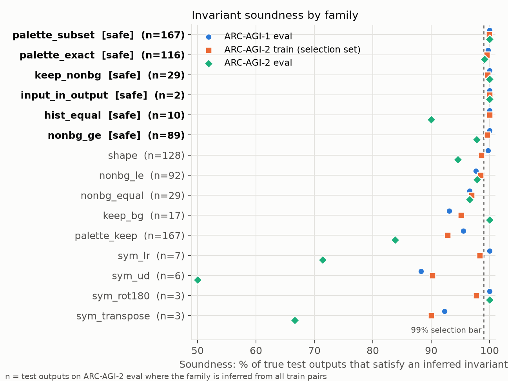
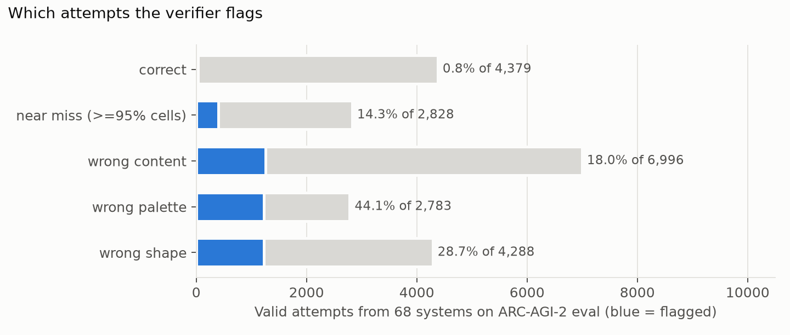
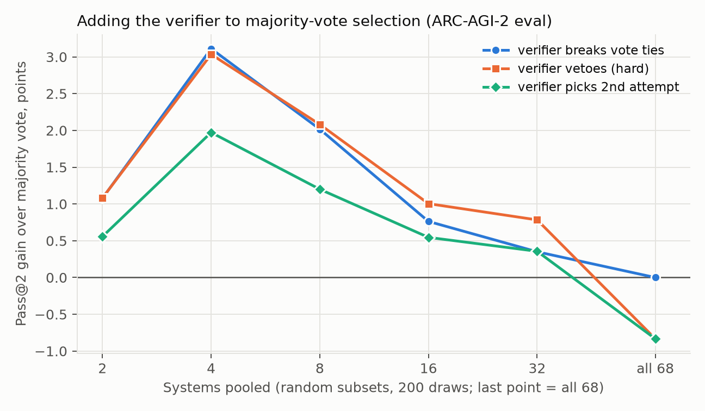

# The Demonstrations Are a Verifier: Train-Pair Invariants for ARC-AGI-2 Answer Selection

*A zero-parameter CPU check, measured on 80,000 attempts from 68 to 73 AI systems and added to the NVARC Kaggle pipeline*

## Abstract

Every ARC task states its rule through a few demonstration pairs. We turn properties that hold on all demonstrations into a verifier: no model, no training, milliseconds per candidate. Six families selected on the ARC-AGI-2 training set hold for 98.2% of ARC-AGI-2 evaluation outputs, flag 24% of wrong attempts from 68 frontier systems and 0.8% of correct ones. As a one-vote penalty the verifier never lowered average pass@2 in pooled selection and raised pass@1 for 24 of 68 systems. We explain why hard vetoes help small pools but hurt saturated ones, and ship the verifier in our NVARC-based submission (public score 29.72), where its measured effect is zero.

## 1. Introduction

ARC-AGI measures how efficiently a system acquires a skill from a few examples. Strong ARC-AGI-2 systems produce many candidates but may submit two. Pooling eight random frontier systems puts a correct answer in the pool for 76.6% of public evaluation tasks, yet majority vote picks it for only 56.3%. How much of that gap can the task's own demonstrations close, and how reliable are such checks on a benchmark built to defeat shortcuts?

## 2. Prior work

Winning Kaggle systems score candidates with the generator: likelihood under augmentations (ARChitects 2024, Franzen et al. 2025) or NVARC's kgmon (2025 winner), augmented-decode hits minus augmented negative log-likelihood. Program-synthesis systems keep programs that reproduce every train pair (icecuber 2020, Greenblatt 2024, SOAR 2025), and so cannot check transductive outputs. We found no measurement of how often demonstration-level invariants transfer to ARC-AGI-2 test outputs, or of their effect on selection.

## 3. Approach

**Invariant families.** A family is *inferred* when it holds on every train pair; a candidate for the test input is *flagged* when it violates an inferred family. 16 families:
- **Shape:** a version space of size rules `a·feature/q + b` over input size, bounding box, colour and object counts; flagged only if no consistent rule fits the candidate.
- **Palette:** *exact* (same colours added and removed in every pair, or constant output palette), *subset* (output ⊆ input ∪ colours ever added), *keep*.
- **Counts:** histogram equal; non-background count equal, non-decreasing or non-increasing.
- **Content:** non-background pixels kept; background kept; crop of the input; input embedded in the output.
- **Symmetry:** four output symmetries.

**Safe families.** On the ARC-AGI-2 *training* set (1,076 test outputs) we keep families inferred at least 30 times that hold at least 99% of the time. Six survive: palette_exact, palette_subset, hist_equal, nonbg_ge, keep_nonbg, input_in_output. Shape (98.6%) and the symmetries miss the bar.

**Using flags.** (a) *Attempt order:* swap the two attempts when only attempt 1 is flagged. (b) *Pool selection:* rank candidates by support (votes, or NVARC hits) minus λ·flag; λ=0 is the baseline, λ=∞ a hard veto. We use λ=1: one violated invariant costs one vote, a tie-breaker for integer votes.

**Kaggle submission.** We fork the NVARC 2025 notebook (Qwen3-4B, per-task LoRA test-time training, DFS decoding, kgmon selection) and change only the final ranking, to kgmon − 1·flag. With no flags the output is identical; the extra CPU time is seconds.

## 4. Why it works, and when it hurts

**Soundness.** A task applies one rule to every pair, so a property implied by the rule also holds on the test. A property holding on k demonstrations *by coincidence* must get lucky k times, and per-pair coincidence rates (pass rates on unrelated tasks' outputs) are 0.4% for palette_exact and 0% for keep_nonbg and hist_equal. The remaining failures are **coverage gaps**: the demonstrations never show the part of the rule the test needs. All three ARC-AGI-2 evaluation failures are of this kind (446ef5d2: a different colour takes the removed role; 581f7754: the test output drops a pixel every demonstration kept; e376de54: the test shrinks a count no demonstration shrinks).

**Selection risk.** Let ε = P(flag | correct). Raising λ changes a task only when the correct answer c* crosses the top-2 boundary: a **gain** needs a flagged wrong candidate less than λ support above an unflagged c*; a **loss** needs a flagged c* with two unflagged candidates less than λ below it. For a hard veto the loss is about ε·P(c* already in top-2), which grows as the base selector improves while the gain shrinks: hard vetoes help weak pools and hurt saturated ones. With λ=1 a loss also needs c* tied on support, making it second-order.

## 5. Results

Attempts: Hugging Face arcprize public-eval datasets; intervals: 95% task bootstraps.

**Soundness (Fig. 1).** The six safe families jointly hold for 99.2% of ARC-AGI-2 training outputs, 98.2% of ARC-AGI-2 evaluation outputs and 99.8% of ARC-AGI-1 evaluation outputs, and reject 90.6% of outputs from unrelated tasks. ARC-AGI-2 is harder: train-consistent size rules hold for 94.5% of its evaluation outputs against 99.7% on ARC-AGI-1.

**Error taxonomy (Fig. 2).** The 22,320 ARC-AGI-2 attempt slots from 68 systems are 19.6% correct, 31.3% wrong content, 19.2% wrong shape, 12.7% near misses (right shape and palette, ≥95% of cells), 12.5% wrong palette and 4.7% invalid. The verifier flags 24.4% of valid wrong attempts (44.1% of wrong-palette, 14.3% of near misses) and 0.8% of correct ones; on ARC-AGI-1 (57,854 slots, 73 systems) 23.9% and 0.4%.

**Attempt order.** Swapping flagged first attempts: ARC-AGI-2, 24 of 68 systems improved and none got worse (57 fixed, 2 broken), +0.51 pass@1 points [0.36, 0.65]; ARC-AGI-1, 61 of 73 improved (321 fixed, 0 broken), +1.12 [0.98, 1.28].

**Pooled selection (Fig. 3).** Pass@2 (%) on ARC-AGI-2 for random pools, 200 draws per size:

| Systems | Vote | One-vote penalty | Hard veto |
|---|---|---|---|
| 2 | 36.4 | +1.1 [0.7, 1.4] | +1.1 |
| 4 | 42.9 | +3.1 [2.4, 3.9] | +3.0 |
| 8 | 56.3 | +2.0 [1.5, 2.6] | +2.1 |
| 16 | 72.5 | +0.8 [0.4, 1.1] | +1.0 |
| 32 | 80.7 | +0.4 [0.1, 0.7] | +0.8 |
| all 68 | 84.9 | 0.0 | −0.8 [−2.5, 0.0] |

The one-vote penalty is never negative on average and lost to plain voting in only 14 of 1,000 random pools. The hard veto turns negative on the full pool, where the losses are the coverage-gap tasks, as Section 4 predicts. On ARC-AGI-1, with rarer coverage gaps (0.24% of outputs), both rules are non-negative at every size.

**NVARC's own candidates.** NVARC's pools for the four evaluation tasks of the commit run hold five test outputs, 91 beams and 35 distinct candidates, 31 wrong. The verifier flagged one (a wrong near miss violating keep_nonbg), no correct one, changed one output's top-2 and left the score at 3.0/4 for every λ from 0.5 to a hard veto. Where NVARC solved an output, kgmon already ranked the correct answer first; its wrong candidates are mostly near misses, the class the verifier catches least, and on the unsolved 0934a4d8 all 13 candidates had the wrong palette, none flagged. The effect on NVARC is zero here.

**Kaggle leaderboard.** Public score **29.72**, submission ID **56275620**, notebook version 2. Unmodified NVARC copies score 30.6 to 31.8; identical code varies by about a point per run (test-time training, 12-hour cut-off).

## 6. Limitations

- **Pool source:** frontier-LLM attempts; NVARC pools cover four tasks (all 120 need 12 hours of 4×L4).
- **Penalty:** λ=1 suits integer support; kgmon mixes hits with likelihood, so a calibrated λ may do better.
- **Recall:** hand-designed families catch 24% of wrong LLM answers, few near misses, 1 of 31 wrong NVARC candidates.
- **Sample size:** 120 evaluation tasks; intervals cover task sampling only.

## 7. Conclusion

The demonstrations already contain a verifier: free, sound on 98% of ARC-AGI-2 evaluation outputs, and strong enough to lift pass@1 and small-pool selection. It cannot help a selector whose errors are near misses; its failures mark where ARC-AGI-2 demands generalization beyond the demonstrations. Treat a flag as one vote, not a veto.

## AI assistance and reproducibility

All code (verifier, analysis scripts, figures, notebook changes) and this text were written by Claude (Anthropic) through Claude Code from the author's prompts, which set the research question, invariant families, safety criterion, experiments and Kaggle constraints; the author reviewed every step and is responsible for all claims. Claude also read the Kaggle forum, the NVARC write-up and public reproductions to fork the pipeline. NVARC code and weights are used as published; experiments ran CPU-only in minutes. Data: arcprize/ARC-AGI-2 (Apache-2.0), fchollet/ARC-AGI, Hugging Face arcprize attempt datasets (MIT). Code: the public notebook in Project Links; analysis scripts (`experiments/`), result files and this text are at https://github.com/CVasilopoulos/arc-agi2-invariant-verifier (CC BY 4.0).
